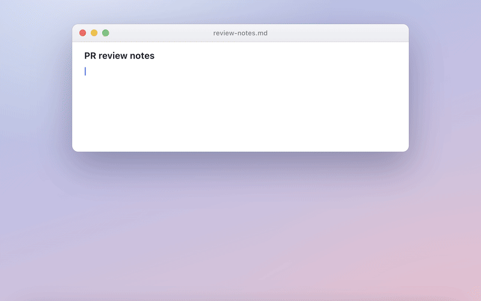
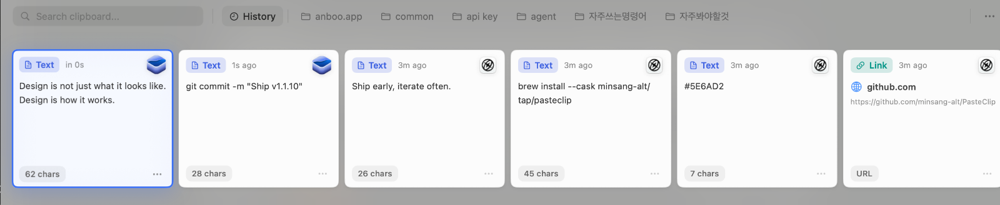

<p align="center">
  
</p>

<h1 align="center">Clipbara</h1>

<p align="center">
  <strong>免费开源的 macOS 原生剪贴板管理器</strong>
  <br>
  卡片式界面类似付费应用 Paste，数据完全本地存储。
</p>

<p align="center">
  <a href="README.md">English</a> | 简体中文
</p>

> **Clipbara 原名 PasteClip**，因 Mac App Store 上已有同名应用，于 2026 年 8 月改名。v1.1.11 及更早版本仍使用 PasteClip 名称，旧链接会自动跳转。

<p align="center">
  <a href="https://github.com/mobrava/Clipbara/releases/latest"></a>
  <a href="https://github.com/mobrava/Clipbara/releases"></a>
  <a href="https://github.com/mobrava/Clipbara/stargazers"></a>
  <a href="LICENSE"></a>
  
</p>

<p align="center">
  
</p>

## 简介

Clipbara 是一款免费开源（GPL-3.0）的 macOS 剪贴板管理器，用原生 Swift 6 + SwiftUI 编写，卡片式界面类似付费应用 Paste。数据完全本地存储，无账号、无服务器、无遥测。

## 主要功能

- **卡片式剪贴板历史**：支持文本、富文本、HTML、图片、链接、文件、颜色和代码片段
- **不打断工作流**：`⌘⇧V` 唤出非激活面板，当前应用保持焦点；单击卡片即复制到剪贴板并自动收起面板，回到当前应用直接 `⌘V` 粘贴
- **Pinboards 收藏夹**：把常用内容整理成命名收藏夹，支持拖拽排序
- **快速预览**：按 `空格` 进行 Quick Look 预览，支持全键盘操作
- **隐私控制**：可排除指定应用（如密码管理器），历史上限可配置、自动清理
- **对终端友好**：图片以 PNG + file URL 方式写入剪贴板，可以可靠地粘贴到 Ghostty / iTerm2（详见下方[终端中的图片剪贴](#终端中的图片剪贴)）
- **完全本地**：基于 SwiftData 本地存储，唯一的网络请求是 Sparkle 检查更新

## 截图

<p align="center">
  
</p>

## 安装

要求 **macOS 14 Sonoma 或更高版本**。

### Homebrew（推荐）

```bash
brew install --cask mobrava/tap/clipbara
```

### 手动下载

从 [GitHub Releases](https://github.com/mobrava/Clipbara/releases/latest) 下载最新 `.dmg`，拖入「应用程序」文件夹。

应用已使用 Apple Developer ID 签名并通过 Apple 公证（自 v1.1.11 起），首次启动不会出现安全提示。

## 终端中的图片剪贴

选择图片剪贴项会把图片重新放回 macOS 剪贴板，但 shell 提示符本身无法接收图片数据。必须由终端中运行的应用或 CLI 支持剪贴板图片输入。

以 macOS 上的 Codex CLI 为例：

1. 按 `⌘ ⇧ V` 并选择需要复用的图片剪贴项。
2. 回到 Codex，中途不要再复制其他内容。
3. 在 Codex 中按 `Control + V` 附加剪贴板图片。

Codex 使用 `Control + V` 附加图片，而不是 macOS 常用的 `⌘ V` 文本粘贴快捷键。其他终端应用可能有不同的图片粘贴方式。

## 更多内容

键盘快捷键、隐私说明、从源码构建、参与贡献等完整文档请参阅 [英文 README](README.md)。

## 许可证

[GNU General Public License v3.0](LICENSE)
